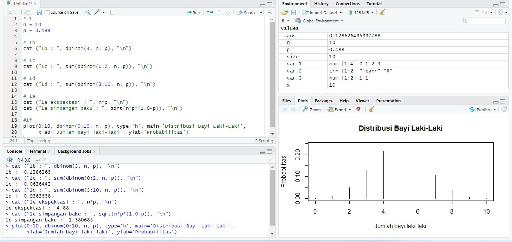

# Praktikum 1 Probstat
Nama  : Richard Ryan  
NRP   : 5025211141  
Kelas : C  

# No 1  
Probabilitas seorang bayi lahir laki-laki = 0.488
Terdapat 10 kelahiran
## 1a  
### Apakah distribusi yang sesuai?  
Distribusi yang digunakan adalah distribusi bernoulli, sebab dalam suatu kelahiran hanya terdapat 2 kemungkinan yaitu laki-laki dan bukan laki-laki (perempuan)  
Adapun rumus yang dapat digunakan adalah C(10, x) * 0.488^x * (1-0.488)^(10-x) untuk 0 <= x <= 10
## 1b
### Berapa probabilitas terdapat tepat 3 bayi laki-laki?
Kemungkinan terdapat tepat 3 bayi laki-laki adalah C(10,3) * 0.488^3 * (1-0.488)^7 = 0.1286265  
Dalam notasi bahasa R : dbinom(3, 10, 0.488) = 0.1286265  
## 1c
### Berapa probabilitas terdapat kurang dari 3 bayi laki-laki?
Terdapat kurang dari 3 bayi laki-laki artinya terdapat 0, 1, atau 2 bayi laki laki  
Probabilitasnya dapat didapat dengan mensubstitusikan nilai x pada rumus dengan 0, 1, dan 2 kemudian hasil ketiganya dijumlahkan  
Dalam notasi bahasa R dapat digunakan : sum(dbinom(0:2, 10, 0.488)) = 0.0636442  
## 1d
### Berapa probabilitas terdapat 3 atau lebih bayi laki-laki?
Terdapat 3 atau lebih bayi laki-laki artinya terdapat 3, 4, 5, 6, 7, 8, 9, atau 10 bayi laki-laki  
Probabilitasnya dapat didapat dengan mensubstitusikan nilai x pada rumus dengan 3, 4, 5, 6, 7, 8, 9, atau 10 kemudian hasil ketiganya dijumlahkan  
Dalam notasi bahasa R dapat digunakan : sum(dbinom(3:10, 10, 0.488)) = 0.9363558  
## 1e
### Berapa nilai harapannya?
Nilai harapan / ekspektasi dari suatu distribusi binomial adalah perkalian jumlah percobaan dengan kemungkinan suksesnya  
Dalam soal ini, jumlah percobaan adalah 10 dan kemungkinan sukses adalah 0.488  
Maka nilai harapannya adalah 10 * 0.488 = 4.88  
### Berapa nilai simpangan bakunya?
Nilai simpangan baku / standar deviasi dari suatu distribusi binomial adalah akar dari variannya  
Nilai varian dari distribusi binomial adalah perkalian antara jumlah percobaan, kemungkinan sukses, dan kemungkinan gagal  
Maka nilai simpangan bakunya adalah sqrt(10 * 0.488 * (1-0.488)) = 1.580683  
## 1f & Foto

