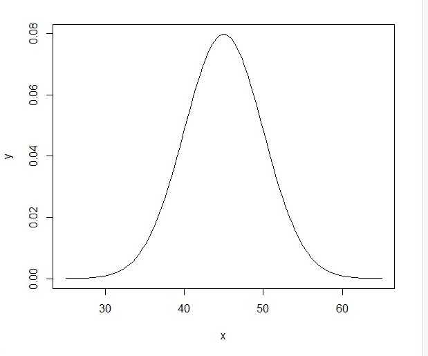
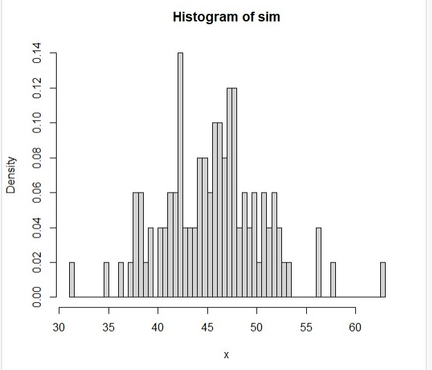
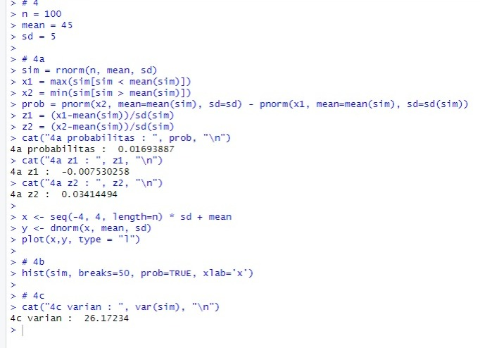
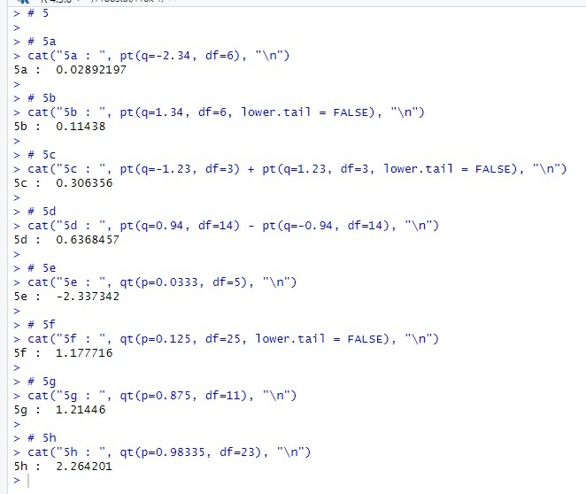

# Praktikum 1 Probstat
Nama  : Richard Ryan  
NRP   : 5025211141  
Kelas : C  

# No 1  
Probabilitas seorang bayi lahir laki-laki = 0.488
Terdapat 10 kelahiran
## 1a  
### Apakah distribusi yang sesuai?  
Distribusi yang digunakan adalah distribusi bernoulli, sebab dalam suatu kelahiran hanya terdapat 2 kemungkinan yaitu laki-laki dan bukan laki-laki (perempuan)  
Adapun rumus yang dapat digunakan adalah **C(10, x) * 0.488^x * (1-0.488)^(10-x)** untuk 0 <= x <= 10
## 1b
### Berapa probabilitas terdapat tepat 3 bayi laki-laki?
Kemungkinan terdapat tepat 3 bayi laki-laki adalah C(10,3) * 0.488^3 * (1-0.488)^7 = 0.1286265  
Dalam notasi bahasa R : dbinom(3, 10, 0.488) = **0.1286265**  
## 1c
### Berapa probabilitas terdapat kurang dari 3 bayi laki-laki?
Terdapat kurang dari 3 bayi laki-laki artinya terdapat 0, 1, atau 2 bayi laki laki  
Probabilitasnya dapat didapat dengan mensubstitusikan nilai x pada rumus dengan 0, 1, dan 2 kemudian hasil ketiganya dijumlahkan  
Dalam notasi bahasa R dapat digunakan : sum(dbinom(0:2, 10, 0.488)) = **0.0636442**  
## 1d
### Berapa probabilitas terdapat 3 atau lebih bayi laki-laki?
Terdapat 3 atau lebih bayi laki-laki artinya terdapat 3, 4, 5, 6, 7, 8, 9, atau 10 bayi laki-laki  
Probabilitasnya dapat didapat dengan mensubstitusikan nilai x pada rumus dengan 3, 4, 5, 6, 7, 8, 9, atau 10 kemudian hasil ketiganya dijumlahkan  
Dalam notasi bahasa R dapat digunakan : sum(dbinom(3:10, 10, 0.488)) = **0.9363558**  
## 1e
### Berapa nilai harapan dan simpangan bakunya?
Nilai harapan / ekspektasi dari suatu distribusi binomial adalah perkalian jumlah percobaan dengan kemungkinan suksesnya  
Dalam soal ini, jumlah percobaan adalah 10 dan kemungkinan sukses adalah 0.488  
Maka nilai harapannya adalah 10 * 0.488 = **4.88**  

Nilai simpangan baku / standar deviasi dari suatu distribusi binomial adalah akar dari variannya  
Nilai varian dari distribusi binomial adalah perkalian antara jumlah percobaan, kemungkinan sukses, dan kemungkinan gagal  
Maka nilai simpangan bakunya adalah sqrt(10 * 0.488 * (1-0.488)) = **1.580683**  
## 1f

## Foto & Output

# No 2
Rentang waktu = 20 tahun  
Rata-rata kejadian = 1.8
## 2a
### Apakah distribusi yang sesuai?
Distribusi yang digunakan adalah distribusi poisson sebab data yang diberikan berupa rata-rata kejadian (1.8 kematian oleh kanker) dalam rentang waktu tertentu (20 tahun)  
Adapun rumus yang dapat digunakan adalah **e^(-1.8) * 1.8^k / k!**
## 2b
### Terdapat 4 kematian yang terjadi, berapa probabilitasnya? Apakah itu tidak wajar?
Dapat disubstitusikan nilai k=4 ke rumus yang kita miliki untuk menghasilkan hasil sebesar **0.07230173** atau sekitar 7.23%  
Dalam bahasa R : dpois(4, 1.8)  
Menurut saya data tersebut menunjukkan bahwa kejadian tersebut relatif **tidak wajar** sebab nilai probabilitas cukup rendah dan jumlah kematiannya bahkan lebih dari 2 kali rata-rata  
## 2c
### Berapa peluang terdapat paling banyak 4 kematian?
Dapat disubstitusikan nilai k=0, 1, 2, 3, dan 4 ke rumus yang kita miliki kemudian nilainya kita jumlahkan dan nantinya akan didapat nilai probabilitas **0.9635933** atau sekitar 96.36%  
Dalam bahasa R : sum(dpois(0:4, lambda=lambda))
## 2d
### Berapa pelurang terdapat lebih dari 4 kematian?
Karena distribusi yang digunakan adalah distribusi poisson maka sayangnya tidak terdapat batasan atas untuk nilai k  
Sehingga kita harus berpikir dari sisi komplemen  
Komplemen dari pertanyaan ini adalah berapakah peluang bahwa paling banyak terdapat 4 kematian? Dari soal sebelumnya telah didapatkan nilai 0.9635933  
Maka untuk menjawab soal ini kita kurangkan probabilitas penuh (1) dengan probabilitas komplemen (0.9635933) sehingga didapat bahwa peluangnya adalah **0.03640666** atau sekitar 3.64%
## 2e
### Berapakah nilai harapan dan standar deviasinya?
Nilai harapan dari distribusi poisson adalah nilai rata rata kejadian  
Maka nilai harapan = **1.8** 

Nilai standar deviasi dari distribusi poisson adalah akar dari variannya  
Nilai varian dari distribusi poisson adalah nilai rata-rata kejadian  
Maka nilai standar deviasi = sqrt(1.8) = **1.341641** 
## 2f

## 2g
### Lakukan simulasi
Untuk melakukan simulasi distribusi poisson pada bahasa R, dapat digunakan fungsi rpois(n, lambda) dimana n menyatakan jumlah percobaan dan lambda menyatakan rata-rata kejadian  
Kali-ini saya menggunakan 100.000 percobaan demi kepastian data
## 2h
### Bandingkan hasil simulasi dengan 2d
Dari 100.000 percobaan didapatkan data sebagai berikut :  
Rata-rata = 1.79667  
Median = 2  
Varian = 1.792105  
Standar Deviasi = 1.338695  
Jumlah kematian > 4 = 3592  

Berdasarkan jawaban 2d, seharusnya terdapat 0.03640666 * 100000 = 3640.666 ~ 3641 percobaan dengan kematian > 4  
Terdapat selisih 49 percobaan antara simulasi dengan nilai statistik, angka tersebut sangatlah kecil dan wajar untuk didapatkan melalui simulasi
## Foto & Output

# No 3
x = 3  
df = 10
## 3a
### Fungsi probabilitas dari distribusi chi-square
  
Apabila kita masukkan nilai x=3 dan k=10, maka akan didapatkan nilai probabilitas sebesar **0.02353326**  
Dalam bahasa R : dchisq(3,10)
## 3b

## 3c
### Rataan dan varian
Nilai rata-rata dari distribusi chi-square adalah nilai kebebasannya, maka mean = **10**  

Nilai varian dari distribusi chi-square adalah 2 * nilai kebebasannya, maka varian = 2 * 10 = **20**
## Foto & Output

# No 4
n = 100  
mean = 45  
sd = 5  
## 4a
### Fungsi probabilitas normal P(x1 <= x <= x2); z-score; plot data distribusi normal
Misalkan data distribusi normal yang didapat disimpan di variabel sim  
x1 merupakan data terbesar yang < mean(sim)  
x2 merupakan data terkecil yang > mean(sim)  
Dalam bahasa R : x1 = max(data(data < sim)) dan x2 = min(data(data > sim))

Untuk mendapatkan P(x1 <= x <= x2), bisa dilakukan dengan mengkurangkan P(x <= x2) dengan P(x <= x1)  
Dalam bahasa R : pnorm(x2, mean(sim), sd(sim)) - pnorm(x1, mean(sim), sd(sim))  
Didapat bahwa probabilitas = **0.01693887**  

Karena data x1 dan x2 didapatkan dari simulasi maka mean dan standar deviasi juga milik simulasi  
z1 = (x1 - mean(sim)) / sd(sim)  
z2 = (x2 - mean(sim)) / sd(sim)  
Didapatkan bahwa **z1 = -0.007530258** dan **z2 = 0.03414494**  

## 4b
### Histogram dengan breaks=50

## 4c
### Varian
Dalam bahasa R : var(sim)  
Untuk kali ini didapatkan varian = **26.17234**
## Foto & Output

# No 5
## 5a
### probabilitas terjadi peristiwa acak dengan X <= -2.34 dan derajat kebebasan = 6
Dalam bahasa R : pt(q=-2.34, df=6)  
Didapatkan nilai probabilitas sebesar **0.02892197**  
## 5b
### Probabilitas terjadi peristiwa acak dengan X > 1.34 dan derajat kebebasan = 6
Dalam bahasa R : pt(q=1.34, df=6, lower.tail = FALSE)  
Digunakan lower.tail = FALSE sebab nilai kumulatif yang dicari berada di sisi kanan titik  
Didapatkan nilai probabilitas sebesar **0.11438**  
## 5c
### Probabilitas terjadi peristiwa acak dengan X < -1.23 atau X > 1.23 dan derajat kebebasan = 3
Dalam bahasa R : pt(q=-1.23, df=3) + pt(q=1.23, df=3, lower.tail = FALSE)  
Bagian pt(q=-1.23, df=3) akan menghitung probabilitas peristiwa X < -1.23  
Bagian pt(q=1.23, df=3, lower.tail = FALSE) akan menghitung probabilitas peristiwa X > 1.23  
Apabila kedua probabilitas dijumlahkan maka akan didapat probabilitas dimana X < -1.23 atau X > 1.23  
Didapatkan nilai probabilitas total sebesar **0.306356**
## 5d
### Probabilitas terjadi peristiwa acak dengan -0.94 < X < 0.94 dan derajat kebebasan = 14
Dalam bahasa R : pt(q=0.94, df=14) - pt(q=-0.94, df=14)  
Bagian pt(q=0.94, df=14) akan menghitung probabilitas peristiwa X < 0.94
Bagian pt(q=-0.94, df=14) akan menghitung probabilitas peristiwa X < -0.94  
Apabila kedua probabilitas dikurangkan maka akan didapat probabilitas dimana -0.94 < X < 0.94  
Didapatkan nilai probabilitas total sebesar **0.6368457**
## 5e
### T-score ketika derajat kebebasan = 5 dan probabilitas di kiri titik = 0.0333
Probabilitas di kiri titik berarti probabilitas ketika X < t dan df = 5 adalah 0.0333
Dalam bahasa R : qt(p=0.0333, df=5)  
Didapatkan nilai t adalah **-2.337342**
## 5f
### T-score ketika derajat kebebasan = 25 dan probabilitas di kanan titik = 0.125
Probabilitas di kanan titik berarti probabilitas ketika X > t dan df = 25 adalah 0.125
Dalam bahasa R : qt(p=0.125, df=25, lower.tail = FALSE)  
Didapatkan nilai t adalah **1.177716**
## 5g
### T-score ketika derajat kebebasan = 11 dan probabilitas di interval antara titik dan negatifnya = 0.75
Probabilitas di interval antara titik dan negatifnya berarti probabilitas ketika -t < X < t dan df = 11 adalah 0.75  
Perlu diperhatikan pula bahwa probabilitas ketika X < -t dan df = 11 bernilai sama dengan probabilitas ketika X > t dan df = 11  
Maka dapat disimpulkan bahwa probabilitas ketika X > t dan df = 11 adalah (1 - 0.75) / 2 = 0.125  
Sehingga dapat didapat pula bahwa probabilitas ketika X < t dan df = 11 adalah 1 - 0.125 = 0.875  
Dalam bahasa R : qt(p=0.875, df=11)  
Didapatkan nilai t adalah **1.21446**  
## 5h
### T-score ketika derajat kebebasan = 23 dan probabilitas di luar interval antara titik dan negatifnya = 0.0333
probabilitas di luar interval antara titik dan negatifnya berarti probabilitas ketika X < -t atau X > t saat df = 23 adalah 0.0333  
Perlu diperhatikan pula bahwa probabilitas ketika X < -t dan df = 23 bernilai sama dengan probabilitas ketika X > t dan df = 23  
Maka dapat disimpulkan bahwa probabilitas ketika X > t dan df = 23 adalah 0.0333 / 2 = 0.01665  
Sehingga dapat didapat pula bahwa probabilitas ketika X < t dan df = 23 adalah 1 - 0.01665 = 0.98335  
Dalam bahasa R : qt(p=0.98335, df=23)  
Didapatkan nilai t adalah **2.264201**
## Foto

